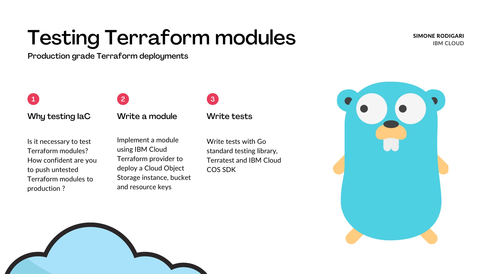

## Build on IBM Cloud with production grade Terraform
As part of a production grade Terraform deployment, testing plays an integral part. This tutorial will demonstrate how to write and effectively test a Terraform module before deploying to a production environment.

This repository provides the codebase for the tutorial [How to test Terraform modules: a simple tutorial using IBM Cloud](https://medium.com/@simone.rodigari/how-to-test-terraform-modules-542ac88f90b3)

## Why testing Infrastructure as Code
Testing Infrastructure as Code (IaC) is as essential as testing any other software code. As part of a Terraform module, multiple resource outputs are normally used and consumed by other resources part of the Terraform stack for a cloud environment. If the outputs are not correct, we could break entire production systems. This not only occurs at resource creation, but also when updating the Terraform configuration for the same resources.

For a production grade Terraform deployment, IaC testing should be performed in automation with dedicated CI pipelines.

## Tutorial Goals
In this tutorial we will perform the following:

1. Create an IBM Cloud COS instance and bucket
1. Create a resource key with Object Writer permissions to the bucket
1. Create a resource key with Reader permissions to the bucket
1. Validate Terraform resources are correctly configured
1. Test COS bucket creation
1. Test writer key can upload an object to the bucket
1. Test reader key can read an object stored in the bucket
1. Test writer and reader key cannot delete an object stored in the bucket

## High level plan
We will create the infrastructure with Terraform in a modularised approach, for the purpose of the tutorial we create one single module. Then we will test the module by creating an example which instantiate the module implementation. Finally we will perform tests using Terratest, which is a Go testing library for terraform, and also IBM Cloud COS SDK for Go, to test with a real client and real resources.

## Prerequisites
The following are requirements for this tutorial, please make sure you have an IBM Cloud account with and apiKey available which has full permissions for COS service. In addition you need to have Terraform, Go and Git installed on your local machine.
1. IBM Cloud account
1. Terraform CLI
1. Go
1. Git

The versions I have currently installed on my environment are as follows:
```bash
❯ terraform version
Terraform v1.3.9
on darwin_amd64

❯ go version
go version go1.20.6 darwin/amd64

❯ git version
git version 2.39.2 (Apple Git-143)
```

## References
* [IBM Cloud docs: cloud-object-storage-using-go](https://cloud.ibm.com/docs/cloud-object-storage?topic=cloud-object-storage-using-go)
* [Tutorial GitHub repo](https://github.com/SRodi/tf-bg-1)
* [Terraform providers registry: IBM-Cloud](https://registry.terraform.io/providers/IBM-Cloud/ibm/latest)

### Quick-start
Export the required environment variables:
```bash
export IC_API_KEY=yourSuperSecretApiKey
export IC_REGION=eu-gb
```

Run the test:
```bash
cd tests
go test -run TestInfraCOSExample
```

Example output:
```terraform
❯ go test -run TestInfraCOSExample
TestInfraCOSExample  terraform [init -upgrade=false]
TestInfraCOSExample  Running command terraform with args [init -upgrade=false]
TestInfraCOSExample  Initializing modules...
TestInfraCOSExample  
TestInfraCOSExample  Initializing the backend...
TestInfraCOSExample  
TestInfraCOSExample  Initializing provider plugins...
TestInfraCOSExample  - Reusing previous version of ibm-cloud/ibm from the dependency lock file
TestInfraCOSExample  - Using previously-installed ibm-cloud/ibm v1.57.0
TestInfraCOSExample  
TestInfraCOSExample  Terraform has been successfully initialized!
TestInfraCOSExample  
TestInfraCOSExample  You may now begin working with Terraform. Try running "terraform plan" to see
TestInfraCOSExample  any changes that are required for your infrastructure. All Terraform commands
TestInfraCOSExample  should now work.
TestInfraCOSExample  
TestInfraCOSExample  If you ever set or change modules or backend configuration for Terraform,
TestInfraCOSExample  rerun this command to reinitialize your working directory. If you forget, other
TestInfraCOSExample  commands will detect it and remind you to do so if necessary.
TestInfraCOSExample  terraform [apply -input=false -auto-approve -lock=false]
TestInfraCOSExample  Running command terraform with args [apply -input=false -auto-approve -lock=false]
TestInfraCOSExample  module.cos.data.ibm_resource_group.resource_group_default: Reading...
TestInfraCOSExample  module.cos.data.ibm_resource_group.resource_group_default: Read complete after 2s [id=4bef339d68b14906b5008348875d13db]
TestInfraCOSExample  
TestInfraCOSExample  Terraform used the selected providers to generate the following execution
TestInfraCOSExample  plan. Resource actions are indicated with the following symbols:
TestInfraCOSExample    + create
TestInfraCOSExample  
TestInfraCOSExample  Terraform will perform the following actions:
TestInfraCOSExample  
TestInfraCOSExample    # module.cos.ibm_cos_bucket.bucket_test will be created
TestInfraCOSExample    + resource "ibm_cos_bucket" "bucket_test" {
TestInfraCOSExample        + bucket_name          = "cos-bucket-tf-test"
TestInfraCOSExample        + crn                  = (known after apply)
TestInfraCOSExample        + endpoint_type        = "public"
TestInfraCOSExample        + force_delete         = true
TestInfraCOSExample        + id                   = (known after apply)
TestInfraCOSExample        + region_location      = "eu-gb"
TestInfraCOSExample        + resource_instance_id = (known after apply)
TestInfraCOSExample        + s3_endpoint_direct   = (known after apply)
TestInfraCOSExample        + s3_endpoint_private  = (known after apply)
TestInfraCOSExample        + s3_endpoint_public   = (known after apply)
TestInfraCOSExample        + storage_class        = "standard"
TestInfraCOSExample      }
TestInfraCOSExample  
TestInfraCOSExample    # module.cos.ibm_resource_instance.resource_instance_cos_test will be created
TestInfraCOSExample    + resource "ibm_resource_instance" "resource_instance_cos_test" {
TestInfraCOSExample        + account_id              = (known after apply)
TestInfraCOSExample        + allow_cleanup           = (known after apply)
TestInfraCOSExample        + created_at              = (known after apply)
TestInfraCOSExample        + created_by              = (known after apply)
TestInfraCOSExample        + crn                     = (known after apply)
TestInfraCOSExample        + dashboard_url           = (known after apply)
TestInfraCOSExample        + deleted_at              = (known after apply)
TestInfraCOSExample        + deleted_by              = (known after apply)
TestInfraCOSExample        + extensions              = (known after apply)
TestInfraCOSExample        + guid                    = (known after apply)
TestInfraCOSExample        + id                      = (known after apply)
TestInfraCOSExample        + last_operation          = (known after apply)
TestInfraCOSExample        + location                = "global"
TestInfraCOSExample        + locked                  = (known after apply)
TestInfraCOSExample        + name                    = "cos-instance-test"
TestInfraCOSExample        + plan                    = "lite"
TestInfraCOSExample        + plan_history            = (known after apply)
TestInfraCOSExample        + resource_aliases_url    = (known after apply)
TestInfraCOSExample        + resource_bindings_url   = (known after apply)
TestInfraCOSExample        + resource_controller_url = (known after apply)
TestInfraCOSExample        + resource_crn            = (known after apply)
TestInfraCOSExample        + resource_group_crn      = (known after apply)
TestInfraCOSExample        + resource_group_id       = "4bef339d68b14906b5008348875d13db"
TestInfraCOSExample        + resource_group_name     = (known after apply)
TestInfraCOSExample        + resource_id             = (known after apply)
TestInfraCOSExample        + resource_keys_url       = (known after apply)
TestInfraCOSExample        + resource_name           = (known after apply)
TestInfraCOSExample        + resource_plan_id        = (known after apply)
TestInfraCOSExample        + resource_status         = (known after apply)
TestInfraCOSExample        + restored_at             = (known after apply)
TestInfraCOSExample        + restored_by             = (known after apply)
TestInfraCOSExample        + scheduled_reclaim_at    = (known after apply)
TestInfraCOSExample        + scheduled_reclaim_by    = (known after apply)
TestInfraCOSExample        + service                 = "cloud-object-storage"
TestInfraCOSExample        + service_endpoints       = (known after apply)
TestInfraCOSExample        + state                   = (known after apply)
TestInfraCOSExample        + status                  = (known after apply)
TestInfraCOSExample        + sub_type                = (known after apply)
TestInfraCOSExample        + tags                    = (known after apply)
TestInfraCOSExample        + target_crn              = (known after apply)
TestInfraCOSExample        + type                    = (known after apply)
TestInfraCOSExample        + update_at               = (known after apply)
TestInfraCOSExample        + update_by               = (known after apply)
TestInfraCOSExample      }
TestInfraCOSExample  
TestInfraCOSExample    # module.cos.ibm_resource_key.key_cos_object_writer will be created
TestInfraCOSExample    + resource "ibm_resource_key" "key_cos_object_writer" {
TestInfraCOSExample        + account_id            = (known after apply)
TestInfraCOSExample        + created_at            = (known after apply)
TestInfraCOSExample        + created_by            = (known after apply)
TestInfraCOSExample        + credentials           = (sensitive value)
TestInfraCOSExample        + credentials_json      = (sensitive value)
TestInfraCOSExample        + crn                   = (known after apply)
TestInfraCOSExample        + deleted_at            = (known after apply)
TestInfraCOSExample        + deleted_by            = (known after apply)
TestInfraCOSExample        + guid                  = (known after apply)
TestInfraCOSExample        + iam_compatible        = (known after apply)
TestInfraCOSExample        + id                    = (known after apply)
TestInfraCOSExample        + name                  = "cos-key-object-writer-test"
TestInfraCOSExample        + resource_group_id     = (known after apply)
TestInfraCOSExample        + resource_instance_id  = (known after apply)
TestInfraCOSExample        + resource_instance_url = (known after apply)
TestInfraCOSExample        + role                  = "Object Writer"
TestInfraCOSExample        + source_crn            = (known after apply)
TestInfraCOSExample        + state                 = (known after apply)
TestInfraCOSExample        + status                = (known after apply)
TestInfraCOSExample        + updated_at            = (known after apply)
TestInfraCOSExample        + updated_by            = (known after apply)
TestInfraCOSExample        + url                   = (known after apply)
TestInfraCOSExample      }
TestInfraCOSExample  
TestInfraCOSExample    # module.cos.ibm_resource_key.key_cos_reader will be created
TestInfraCOSExample    + resource "ibm_resource_key" "key_cos_reader" {
TestInfraCOSExample        + account_id            = (known after apply)
TestInfraCOSExample        + created_at            = (known after apply)
TestInfraCOSExample        + created_by            = (known after apply)
TestInfraCOSExample        + credentials           = (sensitive value)
TestInfraCOSExample        + credentials_json      = (sensitive value)
TestInfraCOSExample        + crn                   = (known after apply)
TestInfraCOSExample        + deleted_at            = (known after apply)
TestInfraCOSExample        + deleted_by            = (known after apply)
TestInfraCOSExample        + guid                  = (known after apply)
TestInfraCOSExample        + iam_compatible        = (known after apply)
TestInfraCOSExample        + id                    = (known after apply)
TestInfraCOSExample        + name                  = "cos-key-reader-test"
TestInfraCOSExample        + resource_group_id     = (known after apply)
TestInfraCOSExample        + resource_instance_id  = (known after apply)
TestInfraCOSExample        + resource_instance_url = (known after apply)
TestInfraCOSExample        + role                  = "Reader"
TestInfraCOSExample        + source_crn            = (known after apply)
TestInfraCOSExample        + state                 = (known after apply)
TestInfraCOSExample        + status                = (known after apply)
TestInfraCOSExample        + updated_at            = (known after apply)
TestInfraCOSExample        + updated_by            = (known after apply)
TestInfraCOSExample        + url                   = (known after apply)
TestInfraCOSExample      }
TestInfraCOSExample  
TestInfraCOSExample  Plan: 4 to add, 0 to change, 0 to destroy.
TestInfraCOSExample  
TestInfraCOSExample  Changes to Outputs:
TestInfraCOSExample    + bucket_name         = "cos-bucket-tf-test"
TestInfraCOSExample    + key_object_writer   = (sensitive value)
TestInfraCOSExample    + key_reader          = (sensitive value)
TestInfraCOSExample    + service_instance_id = (known after apply)
TestInfraCOSExample  module.cos.ibm_resource_instance.resource_instance_cos_test: Creating...
TestInfraCOSExample  module.cos.ibm_resource_instance.resource_instance_cos_test: Still creating... [10s elapsed]
TestInfraCOSExample  module.cos.ibm_resource_instance.resource_instance_cos_test: Creation complete after 18s [id=crn:v1:bluemix:public:cloud-object-storage:global:a/7f57936089fa4570adc362a257bb04a0:7756104a-c094-4834-8e13-ee07be2518bc::]
TestInfraCOSExample  module.cos.ibm_resource_key.key_cos_object_writer: Creating...
TestInfraCOSExample  module.cos.ibm_resource_key.key_cos_reader: Creating...
TestInfraCOSExample  module.cos.ibm_cos_bucket.bucket_test: Creating...
TestInfraCOSExample  module.cos.ibm_resource_key.key_cos_object_writer: Creation complete after 4s [id=crn:v1:bluemix:public:cloud-object-storage:global:a/7f57936089fa4570adc362a257bb04a0:7756104a-c094-4834-8e13-ee07be2518bc:resource-key:2cc846ff-c393-4e6c-8e06-d18845cbb79b]
TestInfraCOSExample  module.cos.ibm_resource_key.key_cos_reader: Creation complete after 4s [id=crn:v1:bluemix:public:cloud-object-storage:global:a/7f57936089fa4570adc362a257bb04a0:7756104a-c094-4834-8e13-ee07be2518bc:resource-key:9e7aec27-3d9c-45a8-b031-ce4e0aa985e9]
TestInfraCOSExample  module.cos.ibm_cos_bucket.bucket_test: Creation complete after 7s [id=crn:v1:bluemix:public:cloud-object-storage:global:a/7f57936089fa4570adc362a257bb04a0:7756104a-c094-4834-8e13-ee07be2518bc:bucket:cos-bucket-tf-test:meta:rl:eu-gb:public]
TestInfraCOSExample  
TestInfraCOSExample  Apply complete! Resources: 4 added, 0 changed, 0 destroyed.
TestInfraCOSExample  
TestInfraCOSExample  Outputs:
TestInfraCOSExample  
TestInfraCOSExample  bucket_name = "cos-bucket-tf-test"
TestInfraCOSExample  key_object_writer = <sensitive>
TestInfraCOSExample  key_reader = <sensitive>
TestInfraCOSExample  service_instance_id = "7756104a-c094-4834-8e13-ee07be2518bc"
TestInfraCOSExample  terraform [destroy -auto-approve -input=false -lock=false]
TestInfraCOSExample  Running command terraform with args [destroy -auto-approve -input=false -lock=false]
TestInfraCOSExample  module.cos.data.ibm_resource_group.resource_group_default: Reading...
TestInfraCOSExample  module.cos.data.ibm_resource_group.resource_group_default: Read complete after 1s [id=4bef339d68b14906b5008348875d13db]
TestInfraCOSExample  
TestInfraCOSExample  Terraform used the selected providers to generate the following execution
TestInfraCOSExample  plan. Resource actions are indicated with the following symbols:
TestInfraCOSExample    - destroy
TestInfraCOSExample  
TestInfraCOSExample  Terraform will perform the following actions:
TestInfraCOSExample  
TestInfraCOSExample    # module.cos.ibm_cos_bucket.bucket_test will be destroyed
TestInfraCOSExample    - resource "ibm_cos_bucket" "bucket_test" {
TestInfraCOSExample        - allowed_ip           = [] -> null
TestInfraCOSExample        - bucket_name          = "cos-bucket-tf-test" -> null
TestInfraCOSExample        - crn                  = "crn:v1:bluemix:public:cloud-object-storage:global:a/7f57936089fa4570adc362a257bb04a0:7756104a-c094-4834-8e13-ee07be2518bc:bucket:cos-bucket-tf-test" -> null
TestInfraCOSExample        - endpoint_type        = "public" -> null
TestInfraCOSExample        - force_delete         = true -> null
TestInfraCOSExample        - hard_quota           = 0 -> null
TestInfraCOSExample        - id                   = "crn:v1:bluemix:public:cloud-object-storage:global:a/7f57936089fa4570adc362a257bb04a0:7756104a-c094-4834-8e13-ee07be2518bc:bucket:cos-bucket-tf-test:meta:rl:eu-gb:public" -> null
TestInfraCOSExample        - region_location      = "eu-gb" -> null
TestInfraCOSExample        - resource_instance_id = "crn:v1:bluemix:public:cloud-object-storage:global:a/7f57936089fa4570adc362a257bb04a0:7756104a-c094-4834-8e13-ee07be2518bc::" -> null
TestInfraCOSExample        - s3_endpoint_direct   = "s3.direct.eu-gb.cloud-object-storage.appdomain.cloud" -> null
TestInfraCOSExample        - s3_endpoint_private  = "s3.private.eu-gb.cloud-object-storage.appdomain.cloud" -> null
TestInfraCOSExample        - s3_endpoint_public   = "s3.eu-gb.cloud-object-storage.appdomain.cloud" -> null
TestInfraCOSExample        - storage_class        = "standard" -> null
TestInfraCOSExample      }
TestInfraCOSExample  
TestInfraCOSExample    # module.cos.ibm_resource_instance.resource_instance_cos_test will be destroyed
TestInfraCOSExample    - resource "ibm_resource_instance" "resource_instance_cos_test" {
TestInfraCOSExample        - account_id              = "7f57936089fa4570adc362a257bb04a0" -> null
TestInfraCOSExample        - allow_cleanup           = false -> null
TestInfraCOSExample        - created_at              = "2023-09-16T09:18:09.775Z" -> null
TestInfraCOSExample        - created_by              = "iam-ServiceId-46fc18c6-40fd-4c4c-bde3-736b3d6597dc" -> null
TestInfraCOSExample        - crn                     = "crn:v1:bluemix:public:cloud-object-storage:global:a/7f57936089fa4570adc362a257bb04a0:7756104a-c094-4834-8e13-ee07be2518bc::" -> null
TestInfraCOSExample        - dashboard_url           = "https://cloud.ibm.com/objectstorage/crn%3Av1%3Abluemix%3Apublic%3Acloud-object-storage%3Aglobal%3Aa%2F7f57936089fa4570adc362a257bb04a0%3A7756104a-c094-4834-8e13-ee07be2518bc%3A%3A" -> null
TestInfraCOSExample        - extensions              = {} -> null
TestInfraCOSExample        - guid                    = "7756104a-c094-4834-8e13-ee07be2518bc" -> null
TestInfraCOSExample        - id                      = "crn:v1:bluemix:public:cloud-object-storage:global:a/7f57936089fa4570adc362a257bb04a0:7756104a-c094-4834-8e13-ee07be2518bc::" -> null
TestInfraCOSExample        - last_operation          = {
TestInfraCOSExample            - "async"       = "false"
TestInfraCOSExample            - "cancelable"  = "false"
TestInfraCOSExample            - "description" = "Completed create instance operation"
TestInfraCOSExample            - "poll"        = "false"
TestInfraCOSExample            - "state"       = "succeeded"
TestInfraCOSExample            - "type"        = "create"
TestInfraCOSExample          } -> null
TestInfraCOSExample        - location                = "global" -> null
TestInfraCOSExample        - locked                  = false -> null
TestInfraCOSExample        - name                    = "cos-instance-test" -> null
TestInfraCOSExample        - plan                    = "lite" -> null
TestInfraCOSExample        - plan_history            = [
TestInfraCOSExample            - {
TestInfraCOSExample                - resource_plan_id = "2fdf0c08-2d32-4f46-84b5-32e0c92fffd8"
TestInfraCOSExample                - start_date       = "2023-09-16T09:18:09.775Z"
TestInfraCOSExample              },
TestInfraCOSExample          ] -> null
TestInfraCOSExample        - resource_aliases_url    = "/v2/resource_instances/7756104a-c094-4834-8e13-ee07be2518bc/resource_aliases" -> null
TestInfraCOSExample        - resource_bindings_url   = "/v2/resource_instances/7756104a-c094-4834-8e13-ee07be2518bc/resource_bindings" -> null
TestInfraCOSExample        - resource_controller_url = "https://cloud.ibm.com/services/" -> null
TestInfraCOSExample        - resource_crn            = "crn:v1:bluemix:public:cloud-object-storage:global:a/7f57936089fa4570adc362a257bb04a0:7756104a-c094-4834-8e13-ee07be2518bc::" -> null
TestInfraCOSExample        - resource_group_crn      = "crn:v1:bluemix:public:resource-controller::a/7f57936089fa4570adc362a257bb04a0::resource-group:4bef339d68b14906b5008348875d13db" -> null
TestInfraCOSExample        - resource_group_id       = "4bef339d68b14906b5008348875d13db" -> null
TestInfraCOSExample        - resource_group_name     = "crn:v1:bluemix:public:resource-controller::a/7f57936089fa4570adc362a257bb04a0::resource-group:4bef339d68b14906b5008348875d13db" -> null
TestInfraCOSExample        - resource_id             = "dff97f5c-bc5e-4455-b470-411c3edbe49c" -> null
TestInfraCOSExample        - resource_keys_url       = "/v2/resource_instances/7756104a-c094-4834-8e13-ee07be2518bc/resource_keys" -> null
TestInfraCOSExample        - resource_name           = "cos-instance-test" -> null
TestInfraCOSExample        - resource_plan_id        = "2fdf0c08-2d32-4f46-84b5-32e0c92fffd8" -> null
TestInfraCOSExample        - resource_status         = "active" -> null
TestInfraCOSExample        - service                 = "cloud-object-storage" -> null
TestInfraCOSExample        - state                   = "active" -> null
TestInfraCOSExample        - status                  = "active" -> null
TestInfraCOSExample        - tags                    = [] -> null
TestInfraCOSExample        - target_crn              = "crn:v1:bluemix:public:globalcatalog::::deployment:2fdf0c08-2d32-4f46-84b5-32e0c92fffd8%3Aglobal" -> null
TestInfraCOSExample        - type                    = "service_instance" -> null
TestInfraCOSExample        - update_at               = "2023-09-16T09:18:13.166Z" -> null
TestInfraCOSExample      }
TestInfraCOSExample  
TestInfraCOSExample    # module.cos.ibm_resource_key.key_cos_object_writer will be destroyed
TestInfraCOSExample    - resource "ibm_resource_key" "key_cos_object_writer" {
TestInfraCOSExample        - account_id            = "7f57936089fa4570adc362a257bb04a0" -> null
TestInfraCOSExample        - created_at            = "2023-09-16T09:18:27.825Z" -> null
TestInfraCOSExample        - created_by            = "iam-ServiceId-46fc18c6-40fd-4c4c-bde3-736b3d6597dc" -> null
TestInfraCOSExample        - credentials           = (sensitive value)
TestInfraCOSExample        - credentials_json      = (sensitive value)
TestInfraCOSExample        - crn                   = "crn:v1:bluemix:public:cloud-object-storage:global:a/7f57936089fa4570adc362a257bb04a0:7756104a-c094-4834-8e13-ee07be2518bc:resource-key:2cc846ff-c393-4e6c-8e06-d18845cbb79b" -> null
TestInfraCOSExample        - guid                  = "2cc846ff-c393-4e6c-8e06-d18845cbb79b" -> null
TestInfraCOSExample        - iam_compatible        = true -> null
TestInfraCOSExample        - id                    = "crn:v1:bluemix:public:cloud-object-storage:global:a/7f57936089fa4570adc362a257bb04a0:7756104a-c094-4834-8e13-ee07be2518bc:resource-key:2cc846ff-c393-4e6c-8e06-d18845cbb79b" -> null
TestInfraCOSExample        - name                  = "cos-key-object-writer-test" -> null
TestInfraCOSExample        - resource_group_id     = "4bef339d68b14906b5008348875d13db" -> null
TestInfraCOSExample        - resource_instance_id  = "crn:v1:bluemix:public:cloud-object-storage:global:a/7f57936089fa4570adc362a257bb04a0:7756104a-c094-4834-8e13-ee07be2518bc::" -> null
TestInfraCOSExample        - resource_instance_url = "/v2/resource_instances/7756104a-c094-4834-8e13-ee07be2518bc" -> null
TestInfraCOSExample        - role                  = "Object Writer" -> null
TestInfraCOSExample        - source_crn            = "crn:v1:bluemix:public:cloud-object-storage:global:a/7f57936089fa4570adc362a257bb04a0:7756104a-c094-4834-8e13-ee07be2518bc::" -> null
TestInfraCOSExample        - state                 = "active" -> null
TestInfraCOSExample        - status                = "active" -> null
TestInfraCOSExample        - updated_at            = "2023-09-16T09:18:27.825Z" -> null
TestInfraCOSExample        - url                   = "/v2/resource_keys/2cc846ff-c393-4e6c-8e06-d18845cbb79b" -> null
TestInfraCOSExample      }
TestInfraCOSExample  
TestInfraCOSExample    # module.cos.ibm_resource_key.key_cos_reader will be destroyed
TestInfraCOSExample    - resource "ibm_resource_key" "key_cos_reader" {
TestInfraCOSExample        - account_id            = "7f57936089fa4570adc362a257bb04a0" -> null
TestInfraCOSExample        - created_at            = "2023-09-16T09:18:27.938Z" -> null
TestInfraCOSExample        - created_by            = "iam-ServiceId-46fc18c6-40fd-4c4c-bde3-736b3d6597dc" -> null
TestInfraCOSExample        - credentials           = (sensitive value)
TestInfraCOSExample        - credentials_json      = (sensitive value)
TestInfraCOSExample        - crn                   = "crn:v1:bluemix:public:cloud-object-storage:global:a/7f57936089fa4570adc362a257bb04a0:7756104a-c094-4834-8e13-ee07be2518bc:resource-key:9e7aec27-3d9c-45a8-b031-ce4e0aa985e9" -> null
TestInfraCOSExample        - guid                  = "9e7aec27-3d9c-45a8-b031-ce4e0aa985e9" -> null
TestInfraCOSExample        - iam_compatible        = true -> null
TestInfraCOSExample        - id                    = "crn:v1:bluemix:public:cloud-object-storage:global:a/7f57936089fa4570adc362a257bb04a0:7756104a-c094-4834-8e13-ee07be2518bc:resource-key:9e7aec27-3d9c-45a8-b031-ce4e0aa985e9" -> null
TestInfraCOSExample        - name                  = "cos-key-reader-test" -> null
TestInfraCOSExample        - resource_group_id     = "4bef339d68b14906b5008348875d13db" -> null
TestInfraCOSExample        - resource_instance_id  = "crn:v1:bluemix:public:cloud-object-storage:global:a/7f57936089fa4570adc362a257bb04a0:7756104a-c094-4834-8e13-ee07be2518bc::" -> null
TestInfraCOSExample        - resource_instance_url = "/v2/resource_instances/7756104a-c094-4834-8e13-ee07be2518bc" -> null
TestInfraCOSExample        - source_crn            = "crn:v1:bluemix:public:cloud-object-storage:global:a/7f57936089fa4570adc362a257bb04a0:7756104a-c094-4834-8e13-ee07be2518bc::" -> null
TestInfraCOSExample        - state                 = "active" -> null
TestInfraCOSExample        - status                = "active" -> null
TestInfraCOSExample        - updated_at            = "2023-09-16T09:18:27.938Z" -> null
TestInfraCOSExample        - url                   = "/v2/resource_keys/9e7aec27-3d9c-45a8-b031-ce4e0aa985e9" -> null
TestInfraCOSExample        - role                  = "Reader" -> null
TestInfraCOSExample      }
TestInfraCOSExample  
TestInfraCOSExample  Plan: 0 to add, 0 to change, 4 to destroy.
TestInfraCOSExample  
TestInfraCOSExample  Changes to Outputs:
TestInfraCOSExample    - bucket_name         = "cos-bucket-tf-test" -> null
TestInfraCOSExample    - key_object_writer   = (sensitive value)
TestInfraCOSExample    - key_reader          = (sensitive value)
TestInfraCOSExample    - service_instance_id = "7756104a-c094-4834-8e13-ee07be2518bc" -> null
TestInfraCOSExample  module.cos.ibm_resource_key.key_cos_object_writer: Destroying... [id=crn:v1:bluemix:public:cloud-object-storage:global:a/7f57936089fa4570adc362a257bb04a0:7756104a-c094-4834-8e13-ee07be2518bc:resource-key:2cc846ff-c393-4e6c-8e06-d18845cbb79b]
TestInfraCOSExample  module.cos.ibm_resource_key.key_cos_reader: Destroying... [id=crn:v1:bluemix:public:cloud-object-storage:global:a/7f57936089fa4570adc362a257bb04a0:7756104a-c094-4834-8e13-ee07be2518bc:resource-key:9e7aec27-3d9c-45a8-b031-ce4e0aa985e9]
TestInfraCOSExample  module.cos.ibm_cos_bucket.bucket_test: Destroying... [id=crn:v1:bluemix:public:cloud-object-storage:global:a/7f57936089fa4570adc362a257bb04a0:7756104a-c094-4834-8e13-ee07be2518bc:bucket:cos-bucket-tf-test:meta:rl:eu-gb:public]
TestInfraCOSExample  module.cos.ibm_cos_bucket.bucket_test: Destruction complete after 1s
TestInfraCOSExample  module.cos.ibm_resource_key.key_cos_reader: Destruction complete after 2s
TestInfraCOSExample  module.cos.ibm_resource_key.key_cos_object_writer: Destruction complete after 2s
TestInfraCOSExample  module.cos.ibm_resource_instance.resource_instance_cos_test: Destroying... [id=crn:v1:bluemix:public:cloud-object-storage:global:a/7f57936089fa4570adc362a257bb04a0:7756104a-c094-4834-8e13-ee07be2518bc::]
TestInfraCOSExample  module.cos.ibm_resource_instance.resource_instance_cos_test: Still destroying... [id=crn:v1:bluemix:public:cloud-object-stor...7756104a-c094-4834-8e13-ee07be2518bc::, 10s elapsed]
TestInfraCOSExample  module.cos.ibm_resource_instance.resource_instance_cos_test: Destruction complete after 14s
TestInfraCOSExample  
TestInfraCOSExample  Destroy complete! Resources: 4 destroyed.
TestInfraCOSExample  
PASS
ok      github.com/SRodi/tf-bg-1        67.734s
```